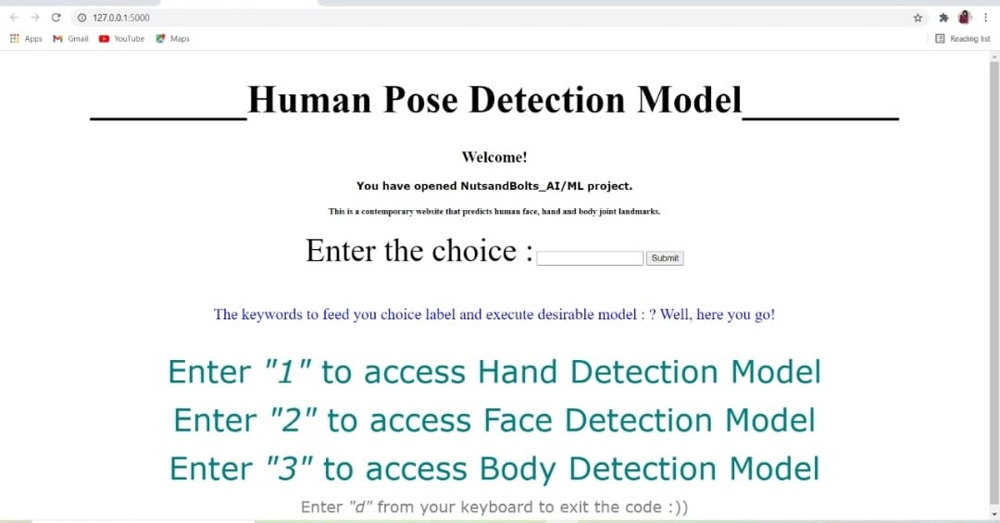

# NutsandBolts_AIML

This python Deep Learning project is developed using python libraries and modules to evolve a website that predicts the co-ordinates of face, hand, and body. The different co-ordinates are joined using the landmarks through straight lines. 

The project is a menu driven function the runs through the input from the user. If input from the user is 1 then the project predicts hand through accepting inputs from the user, if the input is 2 then the project predicts eyes, hands, nose, and mouth co-ordinates on the face. While if user input is three then the project takes webcam inputs and provide body pose predictions. 

The various python modules used in this project are mediapipe, opencv and flask.

Accuracy: The project can predict the organs and joint with the minimum detection accuracy of 0.5 and minimum tracing accuracy of 0.5.

The submit button once pressed releases a webcam that takes live iinputs from the user and displays the reslut. The hand detection model can detect only two hands at a time. The output can be easily terminated by pressing 'd' as a key from the keyboard. Once pressed 'd' the webcam is turned off and website is directed to the page pass.html and display successful run of the model.

The run time view of project is shown in the image below.

