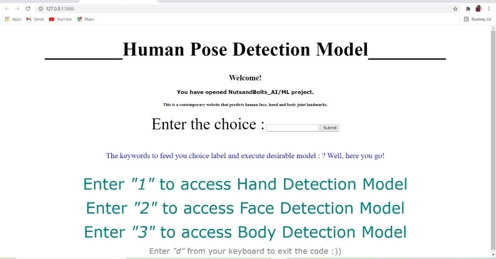
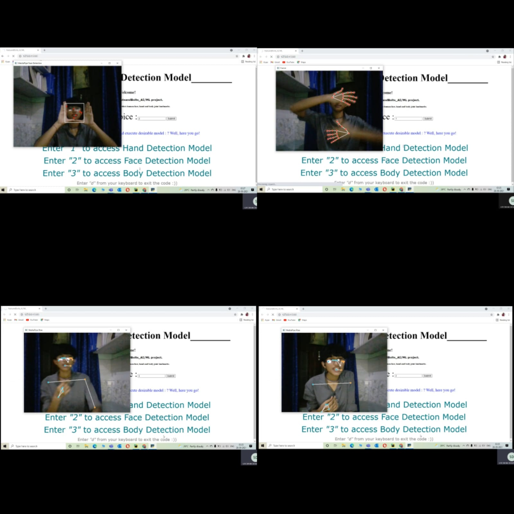
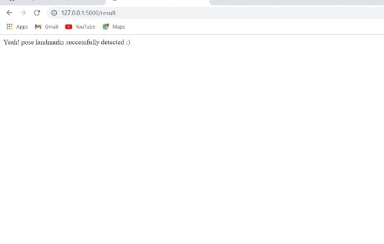

# NutsandBolts_AIML

____________________________________!_HUMAN POSE DETECTION MODEL_! __________________________________

#INTRODUCTION 
Artificial Inteligence and Machine Learning have already stirred up excitement in the human society. AI is growing up fast and will reach human levels no sooner. The key to artificial intelligence has always been representation. Every major player is working on this technology of artificial intelligence, as of now it's begin...... But the day is no far off when artificial intelligence will become a necessity and dependency for every human being. 

If you are also fascinated by the buzz of ML/AI in the fourth industrial revolutioan then congragulation this site will surely help you!

#DESCRIPTION
NutsandBolts_AI/ML is a deep learning based artificial neural network project that has been designed to successfully detect and trace human body joint landmarks with an accuracy of 0.5. 
This project is developed using Pycharm IDE. The model is further generated as a rest app using flask. 
The complete code is written in python and HTML using the in-built modules namely:
Opencv-python and
Mediapipe.

#AIM 
To understand the working of a deep learning model analogous to biological nervous system. 

ARTIFICIAL_NEURAL_NETWORKS: Artificail neural networks(ANN) are called heart of the deep learning algorithms. The ANNs are a junction of several node layers. The first layer is called Input layer and the final layer is called the output layer while remaining all layers are called as hidden layers. The hidden layers determine the depth of neural network. Each hidden layer is dependent on the previous hidden layer through a parameter called weight. We use several techniques to generate these weights for each layer and they are calculated depending on the number of inputs to the respective hidden layer. Each value feed to a node is multiplied with respective weights and summationed. The resultant quantity is manipulated by activation functions to standardize the result in a given range. The various optimizer functions are relu, leaky relu, adam, adagrad and sigmoid. The value generated by the output layer is called "y hat" and is used to calculate loss. This complete execution is called forward propogation. 

Once the loss is generated we use optimizer functions to adjust weights to reduce the output of loss function. This process of adjusting weights to match the magnitude of y hat and predicted y is called backward propogation. A complete execution of forward and backwrd propogation is called an epoch. The network run several epoch cycles to find best possible values for weights.

#DEPENDENCIES
Python in-build modules mediapipe and open-cv are used to write the code for the following AI and neural network based model. Mediapipe is a frmawork for building multimodal cross platforms through applied ML pipelines. Mediapipe solutions are readily available trained ANNs that can be deployed and executed through few lines of code.
Opencv is a platform that provides a real-time computer vision and supports model execution for ML and AI based projects.

The  model is a menu driven function that takes user input to detect specified landmarks. The input feed is accepted from a localhost website and saved in the form of a python dictionary in the webpage pass.html. There are only three valid user inputs to run the model else the model returns error! A user can enter "1" for Hand prediction. By default the model can predict two hands at a time. To predict face box and landmarks user is supposed to enter "2" and press submit label. Similary, "3" will execute pose predictions.
The project takes live input through webcam created using opencv and generates live output. To escape or terminate the code user is expected to pass "d" key from the keyboard and will be directed to "/results" with a successful execution response.

We hope this project was helpful in developing better understanding on analogy among biological neural network and artificial neural networks.

Here is the front end of our restapp!

Some useful visual results for readers to the relate the output of model!

Output of website once the code execution is stopped!

Thank you very much! :)

Team: NUTSandBOLTS
MEMBERS: Diksha Deswal, Prabhash Kumar and Himanshu Singh

X____________________________________X________________________________________X
