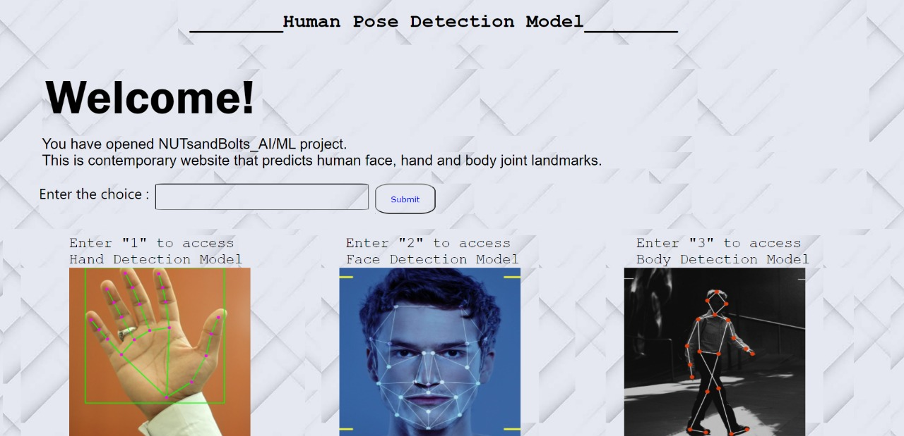

# NutsandBolts_AIML

This python Deep Learning project is developed using python libraries and modules to evolve a website that predicts the co-ordinates of face, hand, and body. The different co-ordinates are joined using the landmarks through straight lines. 

The project is a menu driven function the runs through the input from the user. If input from the user is 1 then the project predicts hand through accepting inputs from the user, if the input is 2 then the project predicts eyes, hands, nose, and mouth co-ordinates on the face. While if user input is three then the project takes webcam inputs and provide body pose predictions. 

The various python modules used in this project are mediapipe and opencv.

Aim: The aim of this project to help the kindergarten children to learn about different sense organs through live webcam inputs and understand better.
The frontend of this module is thus developed to provide necessary information about the organs that different co-ordinates are projecting to.

Accuracy: The project can predict the organs and joint with the minimum detection accuracy of 0.5 and minimum tracing accuracy of 0.5.

